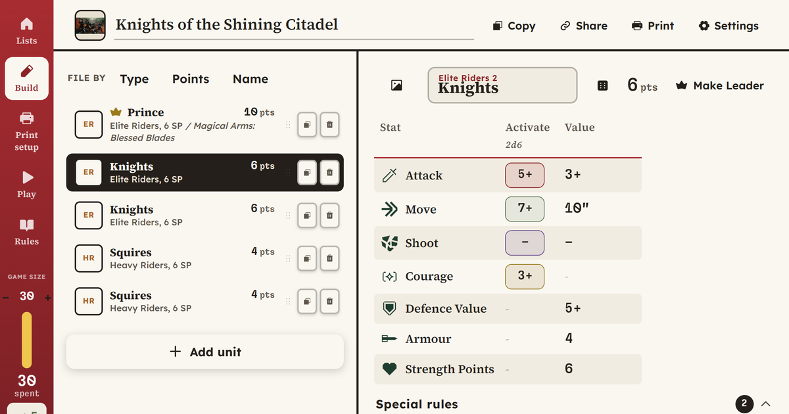

<div align="center">

[](https://type37.github.io/dragon-rampant-2e-warband-builder/)

# Dragon Rampant 2e Warband Builder

### [Open it](https://type37.github.io/dragon-rampant-2e-warband-builder/)

</div>

Assemble and print your warband in this unofficial warband builder for [Dragon Rampant](https://www.ospreypublishing.com/us/dragon-rampant-second-edition-9781472858672/), published by Osprey Games. Unofficial builder by WarLore.

## What it does

- All thirteen unit types, every option and fantastical upgrade, at full rules text.
- Points update live and the list keeps itself legal, caps included.
- Spellcasters pick their colours of magic, with the whole Spellbook built in.
- Ready-made warbands, including the rulebook's sample at 24, 30 and 36 points.
- Print sheet with an optional Spells section, and a tracker for damage, activations, Battered and turns.
- Share as a link. No account, works on a phone.

## Design decisions

- Dresses as its own rulebook: near-white pages, warm near-black ink, and the book's deep crimson sampled from the PDF.
- A port of the [Xenos Rampant builder](https://github.com/Type37/xenos-rampant-force-builder), reskinned and re-dataed. Nothing says "xeno" or "psychic" in the UI any more, even where the code still does.
- Category tints do the sorting: sage foot, rust mounted, iris beasts, brass Leader.
- Storage keys are `drb.*` so the two builders cannot clobber each other on the shared github.io origin.

## Still to do

- No solo or campaign support, unlike the other builders.
- The unit-name field in the detail pane clips long names instead of growing.

## Run it

Vite and React, almost all in `src/App.jsx`, no backend. Node 18+.

```bash
npm install && npm run dev
```

Pushing to `main` deploys to Pages.

## Legal

Dragon Rampant is by Daniel Mersey, published by Osprey Games. Unofficial, not affiliated with Osprey. Font licenses ship in `public/fonts/`.

[Buy the game](https://www.ospreypublishing.com/us/dragon-rampant-second-edition-9781472858672/) · [Report a bug](https://github.com/Type37/dragon-rampant-2e-warband-builder/issues/new/choose) · [WarLore](https://linktr.ee/warlore)
